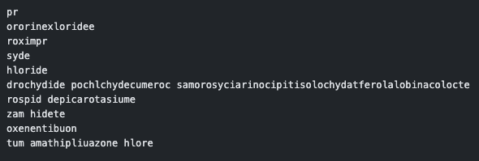
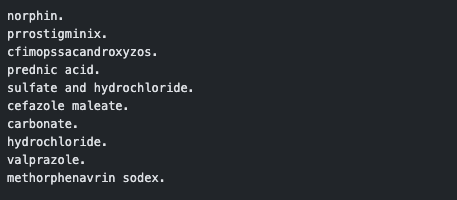

# 🧬 Drug Name Generator

Welcome to the **Drug Name Generator** repository! This project is inspired by Andrej Karpathy's [makemore video series](https://github.com/karpathy/makemore). 

🔍 **Objective**: Create unique drug names Natural Language Processing (NLP). Leveraging a .txt file dataset.

## 📈 Examples of Names Generated

### Bigram Model Output

### Perceptron Model Output

A special thank you to Andrej Kaparthy for sharing his amazing content through the [makemore video series](https://github.com/karpathy/makemore). His work has been a significant inspiration for this project.
